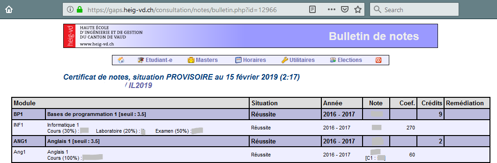

#Gaps - Did I fail ?

Vincent Guidoux

## Introduction

This programm let you know the five last modules and the last five courses you acheived at the HEIG-VD

## Deployment

You need to download the repo and go **inside**:

```javascript
git clone 
cd Gaps_did_I_fail
```

Install the dependencies and copy the `.env`

```
npm i
cp .env.tmp .env
```

You need to put three things in the `.env`

```
LOGIN=
PASSWORD=
ID=
```

The **ID** is the little number in the url of your records. In the picture down below, it's `12966`. This ID is unique for each user and is not changed through time.



Once you done that just :

```
node index.js
```

And **voilà** :

```
Nombre de modules réussis : 16
   - SEC
   - MAI
   - MLO
   - PRO
   - SRL
Nombre de cours réussis : 29
   - R�seaux
   - S�curit� des logiciels
   - Programmation concurrente
   - Syst�mes d'exploitation
   - Projet de semestre
```